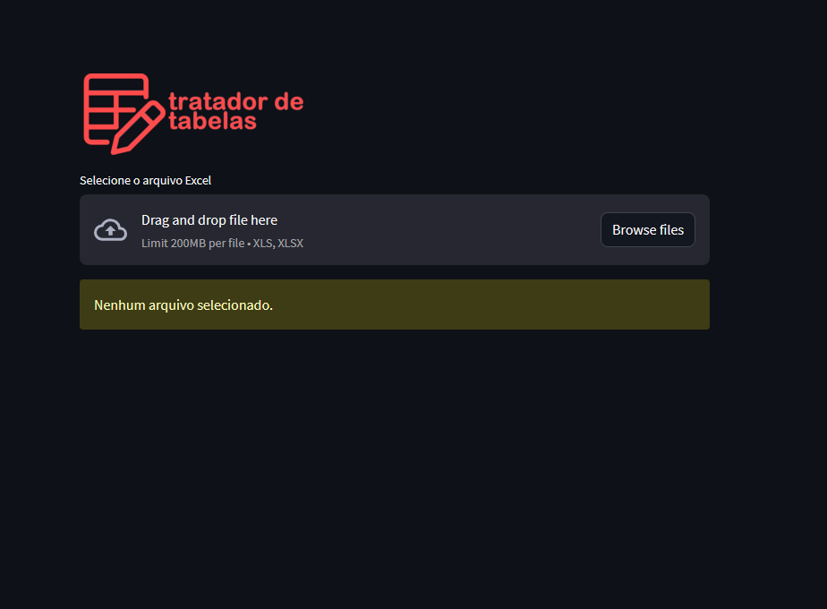
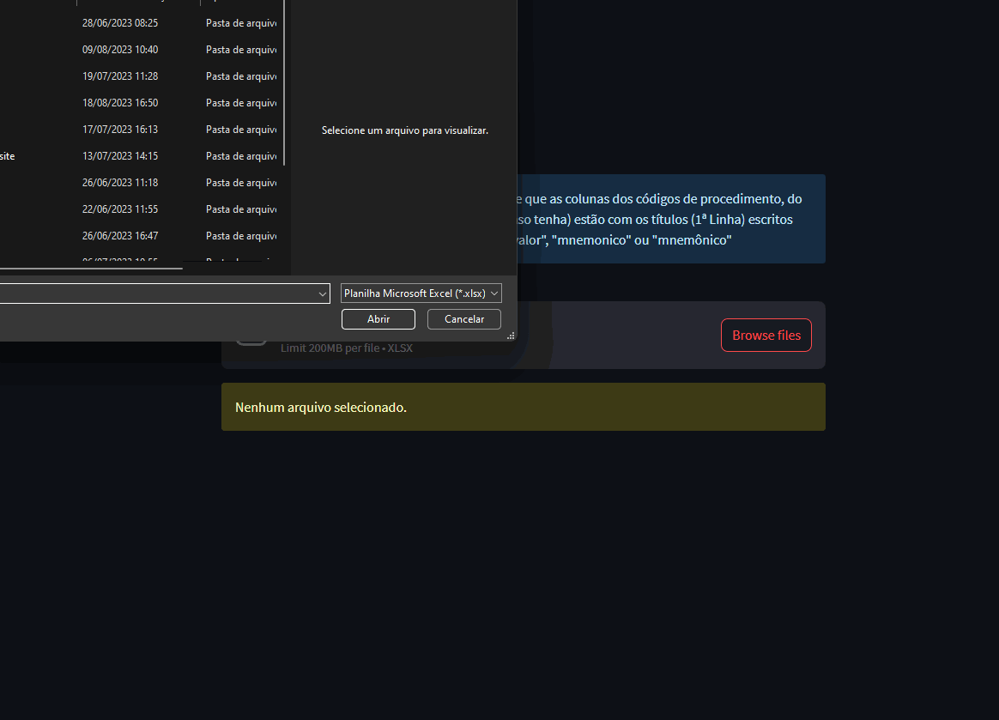

<h1 align="center"> 📈 Tratador de Tabelas 📈 </h1>

Projeto de um programa de tratamento de tabelas de valores de exames. Nele é possível carregar a tabela em excel, selecionar as colunas dos códigos de procedimento e valor, que você quer usar no tratamento, que serão adicionadas na tabela base (que está pronta para importação). Após a seleção das colunas, os dados são tratados e salvos em uma nova tabela com base no modelo que o programa usa de base. E então, o programa gera o download da tabela tratada, em csv. 

<a  href="https://tratatabela.streamlit.app/">Tratador de Tabelas</a>

  <a href="#-tecnologias">Tecnologias</a>

## Imagens e gifs do programa

  
    

 

## 🚀 Tecnologias

Esse projeto foi desenvolvido com Python e suas bibliotecas:

- Pandas
- Streamlit para a versão web
- Re
- Openpyxl
- Base64

por Luan Araujo :wave:
